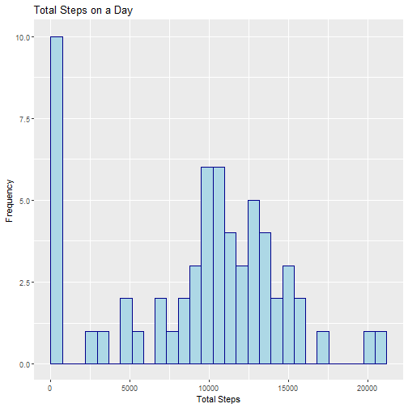
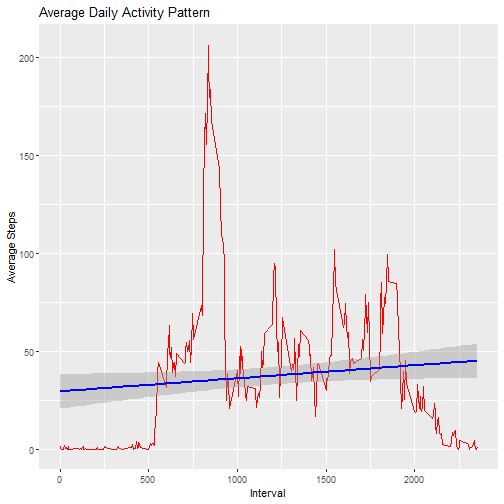
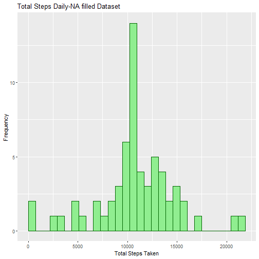
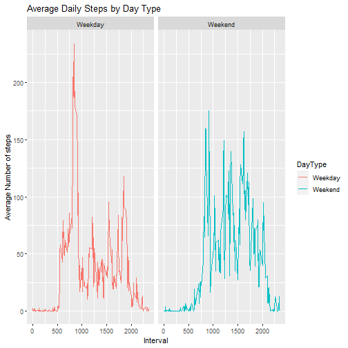

# Peer-graded Assignment: Course Project 1
Author: Chandralekha Ghsoh


This assignment makes use of data from a personal activity monitoring device. This device collects data at 5 minute intervals through out the day. The data consists of two months of data from an anonymous individual collected during the months of October and November, 2012 and include the number of steps taken in 5 minute intervals each day.

The data for this assignment can be downloaded from the course web site:

Dataset: Activity monitoring data [52K]
The variables included in this dataset are:

steps: Number of steps taking in a 5-minute interval (missing values are coded as \color{red}{\verb|NA|}NA)
date: The date on which the measurement was taken in YYYY-MM-DD format
interval: Identifier for the 5-minute interval in which measurement was taken

## Loading and preprocessing the data

Show any code that is needed to

1. Load the data (i.e. \color{red}{\verb|read.csv()|}read.csv())
2. Process/transform the data (if necessary) into a format suitable for your analysis

### Unzipping and Reading


```r
fileUrl <- "https://d396qusza40orc.cloudfront.net/repdata%2Fdata%2Factivity.zip"
download.file(fileUrl, destfile = paste0(getwd(), '/repdata%2Fdata%2Factivity.zip'), method = "curl")
unzip("repdata%2Fdata%2Factivity.zip",exdir = "data")

activityMain<-read.csv("data/activity.csv")

dim(activityMain)
```

```
## [1] 17568     3
```

```r
## formatting date in desirable format convert dates into days to classify into Weekend and Weekday
activityMain$dates<-as.Date(as.character(activityMain$date,"%Y%m%d"))

library(tidyverse)
```

```
## Warning: package 'tidyverse' was built under R version 4.0.3
```

```
## -- Attaching packages --------------------------------------- tidyverse 1.3.0 --
```

```
## v ggplot2 3.3.2     v purrr   0.3.4
## v tibble  3.0.4     v dplyr   1.0.2
## v tidyr   1.1.2     v stringr 1.4.0
## v readr   1.4.0     v forcats 0.5.0
```

```
## Warning: package 'ggplot2' was built under R version 4.0.3
```

```
## Warning: package 'tibble' was built under R version 4.0.3
```

```
## Warning: package 'tidyr' was built under R version 4.0.3
```

```
## Warning: package 'readr' was built under R version 4.0.3
```

```
## Warning: package 'forcats' was built under R version 4.0.3
```

```
## -- Conflicts ------------------------------------------ tidyverse_conflicts() --
## x dplyr::filter() masks stats::filter()
## x dplyr::lag()    masks stats::lag()
```

```r
library(ggplot2)
library(dplyr)
activityMain$DayType<-ifelse(weekdays(activityMain$dates)=="Saturday"|weekdays(activityMain$dates)=="Sunday","Weekend","Weekday")

## Viewing the 6 numbers summary

summary(activityMain)
```

```
##      steps            date              interval          dates              DayType         
##  Min.   :  0.00   Length:17568       Min.   :   0.0   Min.   :2012-10-01   Length:17568      
##  1st Qu.:  0.00   Class :character   1st Qu.: 588.8   1st Qu.:2012-10-16   Class :character  
##  Median :  0.00   Mode  :character   Median :1177.5   Median :2012-10-31   Mode  :character  
##  Mean   : 37.38                      Mean   :1177.5   Mean   :2012-10-31                     
##  3rd Qu.: 12.00                      3rd Qu.:1766.2   3rd Qu.:2012-11-15                     
##  Max.   :806.00                      Max.   :2355.0   Max.   :2012-11-30                     
##  NA's   :2304
```

## What is mean total number of steps taken per day?

For this part of the assignment, you can ignore the missing values in the dataset.

1. Calculate the total number of steps taken per day
2. If you do not understand the difference between a histogram and a barplot, research the difference between them. Make a histogram of the       total number of steps taken each day
3. Calculate and report the mean and median of the total number of steps taken per day


```r
## Total number of steps taken per day

TotalStepsDaily<- activityMain %>%
  
  group_by(dates) %>%
  summarize(TotalSteps=sum(steps,na.rm=TRUE))
```

```
## `summarise()` ungrouping output (override with `.groups` argument)
```

```r
TotalStepsDaily
```

```
## # A tibble: 61 x 2
##    dates      TotalSteps
##    <date>          <int>
##  1 2012-10-01          0
##  2 2012-10-02        126
##  3 2012-10-03      11352
##  4 2012-10-04      12116
##  5 2012-10-05      13294
##  6 2012-10-06      15420
##  7 2012-10-07      11015
##  8 2012-10-08          0
##  9 2012-10-09      12811
## 10 2012-10-10       9900
## # ... with 51 more rows
```

```r
summary(TotalStepsDaily)
```

```
##      dates              TotalSteps   
##  Min.   :2012-10-01   Min.   :    0  
##  1st Qu.:2012-10-16   1st Qu.: 6778  
##  Median :2012-10-31   Median :10395  
##  Mean   :2012-10-31   Mean   : 9354  
##  3rd Qu.:2012-11-15   3rd Qu.:12811  
##  Max.   :2012-11-30   Max.   :21194
```

```r
## histogram of total steps taken

g<-ggplot(TotalStepsDaily,aes(TotalSteps))
g+geom_histogram(boundary=0,col="darkblue",fill="lightblue")+ggtitle("Total Steps on a Day")+xlab("Total Steps")+ylab("Frequency")
```

```
## `stat_bin()` using `bins = 30`. Pick better value with `binwidth`.
```



```r
## mean and median of the total number of steps taken per day
Mean<-mean(TotalStepsDaily$TotalSteps,na.rm=TRUE)
Median<-median(TotalStepsDaily$TotalSteps,na.rm=TRUE)

Mean
```

```
## [1] 9354.23
```

```r
Median
```

```
## [1] 10395
```

## What is the average daily activity pattern?

1. Make a time series plot (i.e. \color{red}{\verb|type = "l"|}type = "l") of the 5-minute interval (x-axis) and the average number of steps      taken, averaged across all days (y-axis)
2. Which 5-minute interval, on average across all the days in the dataset, contains the maximum number of steps?


```r
## Summarizing by interval

AvgStepInterval<- activityMain %>%
  group_by(interval) %>%
  summarize(AvgStep=mean(steps,na.rm=TRUE))
```

```
## `summarise()` ungrouping output (override with `.groups` argument)
```

```r
AvgStepInterval
```

```
## # A tibble: 288 x 2
##    interval AvgStep
##       <int>   <dbl>
##  1        0  1.72  
##  2        5  0.340 
##  3       10  0.132 
##  4       15  0.151 
##  5       20  0.0755
##  6       25  2.09  
##  7       30  0.528 
##  8       35  0.868 
##  9       40  0     
## 10       45  1.47  
## # ... with 278 more rows
```

```r
## Plotting Avg steps per 5 mins interval

g<-ggplot(AvgStepInterval,aes(x=interval, y=AvgStep))
g+geom_line(col="red")+geom_smooth(method="lm",col="blue")+ xlab("Interval")+ylab("Average Steps")+ggtitle("Average Daily Activity Pattern")
```

```
## `geom_smooth()` using formula 'y ~ x'
```



```r
## 5-minute interval that contains the maximum number of steps

Min<-subset(AvgStepInterval,AvgStep== max(AvgStep))
Min
```

```
## # A tibble: 1 x 2
##   interval AvgStep
##      <int>   <dbl>
## 1      835    206.
```

## Imputing missing values

Note that there are a number of days/intervals where there are missing values (coded as \color{red}{\verb|NA|}NA). The presence of missing days may introduce bias into some calculations or summaries of the data.

1. Calculate and report the total number of missing values in the dataset (i.e. the total number of rows with \color{red}{\verb|NA|}NAs)
2. Devise a strategy for filling in all of the missing values in the dataset. The strategy does not need to be sophisticated. For example, you    could use the mean/median for that day, or the mean for that 5-minute interval, etc.
3. Create a new dataset that is equal to the original dataset but with the missing data filled in.
4. Make a histogram of the total number of steps taken each day and Calculate and report the mean and median total number of steps taken per     day. Do these values differ from the estimates from the first part of the assignment? What is the impact of imputing missing data on the      estimates of the total daily number of steps?


```r
## total number & percentage of missing values in the dataset
sum(is.na(activityMain$steps))
```

```
## [1] 2304
```

```r
mean(is.na(activityMain$steps))
```

```
## [1] 0.1311475
```

```r
## filling in all of the missing values in the database by taking mean by interval. First diving the dataset into with missing and non missing values

activityMain$Value<-ifelse(is.na(activityMain$steps),"Missing","NonMissing")

table(activityMain$Value)
```

```
## 
##    Missing NonMissing 
##       2304      15264
```

```r
activityNA<-subset(activityMain,Value=="Missing")

dim(activityNA)
```

```
## [1] 2304    6
```

```r
activityNonNA<-subset(activityMain,Value=="NonMissing")

dim(activityNonNA)
```

```
## [1] 15264     6
```

```r
names(activityNonNA)
```

```
## [1] "steps"    "date"     "interval" "dates"    "DayType"  "Value"
```

```r
names(AvgStepInterval)
```

```
## [1] "interval" "AvgStep"
```

```r
## Merging to fetch avg steps per interval
activityNAFilled<-merge(activityNA,AvgStepInterval,by.x="interval")


## rbinding NA filled dataset with NonNA dataset to create the original dataset with NA having filled with Avg per interval
activityNonNA$AvgStep<-activityNonNA$steps
activityMainFilled<-rbind(activityNonNA,activityNAFilled)

## Changing the name AvgStep (its confusing) to StepsFinal

activityMainFilled2<-activityMainFilled %>%
  rename(StepsFinal=AvgStep)

names(activityMainFilled)
```

```
## [1] "steps"    "date"     "interval" "dates"    "DayType"  "Value"    "AvgStep"
```

```r
##

## Total number of steps taken per day

TotalStepsDaily2<- activityMainFilled2 %>%
  
  group_by(dates) %>%
  summarize(TotalSteps=sum(StepsFinal))
```

```
## `summarise()` ungrouping output (override with `.groups` argument)
```

```r
TotalStepsDaily2
```

```
## # A tibble: 61 x 2
##    dates      TotalSteps
##    <date>          <dbl>
##  1 2012-10-01     10766.
##  2 2012-10-02       126 
##  3 2012-10-03     11352 
##  4 2012-10-04     12116 
##  5 2012-10-05     13294 
##  6 2012-10-06     15420 
##  7 2012-10-07     11015 
##  8 2012-10-08     10766.
##  9 2012-10-09     12811 
## 10 2012-10-10      9900 
## # ... with 51 more rows
```

```r
## A histogram of the total number of steps taken each day

library(ggplot2)
h<-ggplot(TotalStepsDaily2,aes(TotalSteps))+geom_histogram(boundary=0,col="darkgreen",fill="lightgreen")+ggtitle("Total Steps Daily-NA filled Dataset")+xlab("Total Steps Taken")+ylab("Frequency")
print(h)
```

```
## `stat_bin()` using `bins = 30`. Pick better value with `binwidth`.
```



```r
## A comparison of Total daily Steps between pre-filled missing value dataset with filled missing value dataset

Mean_NAFilled<-mean(TotalStepsDaily2$TotalSteps)
Median_NAFilled<-median(TotalStepsDaily2$TotalSteps)
Mean_NAFilled
```

```
## [1] 10766.19
```

```r
Median_NAFilled
```

```
## [1] 10766.19
```

## Are there differences in activity patterns between weekdays and weekends?

For this part the \color{red}{\verb|weekdays()|}weekdays() function may be of some help here. Use the dataset with the filled-in missing values for this part.

1. Create a new factor variable in the dataset with two levels – “weekday” and “weekend” indicating whether a given date is a weekday or         weekend day.
2. Make a panel plot containing a time series plot (i.e. \color{red}{\verb|type = "l"|}type = "l") of the 5-minute interval (x-axis) and the     average number of steps taken, averaged across all weekday days or weekend days (y-axis). See the README file in the GitHub repository to     see an example of what this plot should look like using simulated data


```r
## We have already created two levels, weekend and weekday

## Summarizing by interval

AvgStepInterval2<- activityMain %>%
  group_by(interval, DayType) %>%
  summarize(AvgStep=mean(steps,na.rm=TRUE))
```

```
## `summarise()` regrouping output by 'interval' (override with `.groups` argument)
```

```r
AvgStepInterval2
```

```
## # A tibble: 576 x 3
## # Groups:   interval [288]
##    interval DayType AvgStep
##       <int> <chr>     <dbl>
##  1        0 Weekday   2.33 
##  2        0 Weekend   0    
##  3        5 Weekday   0.462
##  4        5 Weekend   0    
##  5       10 Weekday   0.179
##  6       10 Weekend   0    
##  7       15 Weekday   0.205
##  8       15 Weekend   0    
##  9       20 Weekday   0.103
## 10       20 Weekend   0    
## # ... with 566 more rows
```

```r
## Plotting Avg steps per 5 mins interval
g2<-ggplot(AvgStepInterval2,aes(interval,AvgStep,col=DayType))
g2+geom_line()+ggtitle("Average Daily Steps by Day Type")+ xlab("Interval")+ylab("Average Number of steps")+facet_grid(.~DayType)
```



